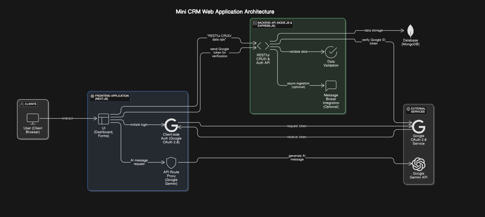

# Xeno CRM - Advanced Customer Relationship Management Platform

<div align="center">
  
  
  
  
  
  
  
  
</div>

## Table of Contents
- [System Architecture](#system-architecture)
- [Dashboard Preview](#dashboard-preview)
- [Core Features](#core-features)
- [Tech Stack](#tech-stack)
- [API Documentation](#api-documentation)
- [Project Structure](#project-structure)
- [Getting Started](#getting-started)

## System Architecture



The Xeno CRM architecture follows a modern full-stack approach with clear separation of concerns:

- **Frontend**: Next.js-based UI with React components and hooks for state management
- **Backend**: Express.js API server with dedicated controllers and services
- **Data Layer**: MongoDB for persistent storage with Mongoose ODM
- **Caching**: Redis for performance optimization
- **External Services**: Integration with AI APIs and message delivery providers

## Dashboard Preview


The intuitive dashboard provides a comprehensive overview of your customer data, orders, campaigns, and analytics in a clean, modern UI.

## Landing Page

A detailed landing page is available in the repository as a PDF document ([localhost_3000_ (1).pdf](localhost_3000_%20(1).pdf)). This showcases the user interface, entry point to the application, and the overall user experience design.

## Core Features

### Customer Management
- Customer CRUD operations via RESTful APIs
- Customer data model with flexible attributes
- Email uniqueness checks scoped by userId
- Customer filtering and search capabilities

### Order Management
- Order tracking and association with customers
- Order history viewing
- Order status updates

### Data Ingestion APIs
- Secure CSV import for customers via `POST /api/data/import/customers`
- Secure CSV import for orders via `POST /api/data/import/orders`
- Sample CSV templates via `GET /api/data/samples/customer` and `GET /api/data/samples/order`
- Comprehensive validation with detailed error reporting
- Support for partial success (HTTP 207) when some rows fail but others succeed

### Authentication & Security
- JWT-based authentication
- Middleware for protecting sensitive endpoints
- Role-based access control
- API path protection

### API Documentation
- Comprehensive Swagger/OpenAPI documentation
- Interactive API testing through Swagger UI
- Detailed request/response schemas
- API accessible at `/api-docs` endpoint

### Campaign Management
- Campaign creation and tracking
- Campaign scheduling
- AI integration for message generation

### Message Delivery System
- AI Smart Scheduling Suggestions
- Multi-channel delivery (SMS, email)
- Batch processing for efficient delivery
- Delivery tracking and receipts via webhooks

### Customer Segmentation
- Rules-based segmentation engine
- Segment creation based on customer attributes
- AND/OR logic for complex segment rules

### Caching System
- Redis-based caching for improved performance
- Fallback to memory cache when Redis is unavailable

### Error Handling
- Comprehensive error handling across the application
- Detailed error responses with appropriate HTTP status codes
- Validation error reporting

## Tech Stack

### Frontend
- **Next.js**: For server-side rendering and routing
- **TypeScript**: For type safety
- **Tailwind CSS**: For responsive UI design
- **React Query**: For data fetching and caching
- **Context API**: For state management

### Backend
- **Node.js**: Runtime environment
- **Express.js**: Web framework
- **TypeScript**: For type safety
- **MongoDB**: Database
- **Mongoose**: ODM for MongoDB
- **Redis**: For caching and message queues
- **JWT**: For authentication
- **Swagger/OpenAPI**: For API documentation
- **Multer**: For file uploads
- **CSV Parser**: For CSV data processing

### AI & Delivery
- **Gemini AI API**: For intelligent content generation
- **Redis Streams**: For message queuing
- **Batch Processing**: For efficient message delivery
- **Webhook Handlers**: For delivery receipts

## API Documentation

The API is fully documented using Swagger/OpenAPI and can be accessed at `/api-docs` when the server is running.

### Key API Endpoints

#### Authentication
- `POST /api/auth/login`: User login
- `POST /api/auth/register`: User registration

#### Customers
- `GET /api/customers`: List customers
- `POST /api/customers`: Create customer
- `GET /api/customers/:id`: Get customer details
- `PUT /api/customers/:id`: Update customer
- `DELETE /api/customers/:id`: Delete customer

#### Orders
- `GET /api/orders`: List orders
- `POST /api/orders`: Create order
- `GET /api/orders/:id`: Get order details
- `PUT /api/orders/:id`: Update order
- `DELETE /api/orders/:id`: Delete order

#### Data Import
- `POST /api/data/import/customers`: Import customers via CSV
- `POST /api/data/import/orders`: Import orders via CSV
- `GET /api/data/samples/customer`: Download customer CSV template
- `GET /api/data/samples/order`: Download order CSV template

#### Segments
- `GET /api/segments`: List segments
- `POST /api/segments`: Create segment
- `GET /api/segments/:id`: Get segment details
- `PUT /api/segments/:id`: Update segment
- `DELETE /api/segments/:id`: Delete segment
- `GET /api/segments/:id/customers`: Get customers in segment

#### Campaigns
- `GET /api/campaigns`: List campaigns
- `POST /api/campaigns`: Create campaign
- `GET /api/campaigns/:id`: Get campaign details
- `PUT /api/campaigns/:id`: Update campaign
- `DELETE /api/campaigns/:id`: Delete campaign
- `POST /api/campaigns/:id/schedule`: Schedule campaign
- `GET /api/campaigns/:id/stats`: Get campaign statistics

#### AI
- `POST /api/ai/generate-message`: Generate campaign message
- `POST /api/ai/suggest-schedule`: Get AI scheduling suggestions

#### Delivery
- `GET /api/delivery/stats`: Get delivery statistics
- `POST /api/delivery/webhook`: Webhook for delivery receipts

## Project Structure

### Frontend Structure
```
frontend/
├── src/
│   ├── app/                  # Next.js 13+ app directory
│   │   ├── dashboard/        # Dashboard pages
│   │   │   ├── customers/    # Customer management pages
│   │   │   ├── orders/       # Order management pages
│   │   │   ├── campaigns/    # Campaign management pages
│   │   │   ├── segment-rules/# Segmentation rules pages
│   │   │   ├── analytics/    # Analytics dashboard pages
│   │   │   └── settings/     # Settings pages
│   ├── components/           # Reusable UI components
│   ├── contexts/             # React contexts
│   ├── hooks/                # Custom React hooks
│   ├── services/             # API service layers
│   ├── styles/               # Global styles and themes
│   └── lib/                  # Utilities and helpers
```

### Backend Structure
```
backend/
├── src/
│   ├── config/               # Configuration files
│   │   ├── db.ts             # Database configuration
│   │   ├── redis.ts          # Redis configuration
│   │   └── swagger.ts        # Swagger configuration
│   ├── controllers/          # Route controllers
│   │   ├── authController.ts # Authentication controller
│   │   ├── customerController.ts # Customer controller
│   │   ├── orderController.ts    # Order controller
│   │   ├── campaignController.ts # Campaign controller
│   │   ├── segmentController.ts  # Segment controller
│   │   ├── aiController.ts       # AI controller
│   │   ├── deliveryController.ts # Delivery controller
│   │   └── uploadController.ts   # File upload controller
│   ├── docs/                 # API documentation
│   │   ├── swagger.ts        # Swagger setup
│   │   ├── auth.doc.ts       # Auth API docs
│   │   ├── data-ingestion.doc.ts # Data ingestion API docs
│   │   └── campaign.doc.ts   # Campaign API docs
│   ├── interfaces/           # TypeScript interfaces
│   ├── middleware/           # Express middlewares
│   │   ├── auth.ts           # Auth middleware
│   │   ├── cache.ts          # Caching middleware
│   │   ├── error.ts          # Error handling middleware
│   │   └── upload.ts         # File upload middleware
│   ├── models/               # Database models
│   │   ├── User.ts           # User model
│   │   ├── Customer.ts       # Customer model
│   │   ├── Order.ts          # Order model
│   │   ├── Segment.ts        # Segment model
│   │   └── Campaign.ts       # Campaign model
│   ├── routes/               # API routes
│   │   ├── authRoutes.ts     # Auth routes
│   │   ├── customerRoutes.ts # Customer routes
│   │   ├── orderRoutes.ts    # Order routes
│   │   ├── segmentRoutes.ts  # Segment routes
│   │   ├── campaignRoutes.ts # Campaign routes
│   │   ├── aiRoutes.ts       # AI routes
│   │   ├── deliveryRoutes.ts # Delivery routes
│   │   └── dataRoutes.ts     # Data import routes
│   ├── services/             # Business logic
│   │   ├── authService.ts    # Auth service
│   │   ├── customerService.ts# Customer service
│   │   ├── orderService.ts   # Order service
│   │   ├── segmentService.ts # Segment service
│   │   ├── campaignService.ts# Campaign service
│   │   ├── aiService.ts      # AI service
│   │   ├── uploadService.ts  # Upload service
│   │   ├── deliveryBatchService.ts # Delivery batch service
│   │   ├── messageDeliveryService.ts # Message delivery service
│   │   └── campaignSchedulerService.ts # Campaign scheduler
│   └── utils/                # Utility functions
│       ├── validation.ts     # Validation utilities
│       ├── errors.ts         # Error handling utilities
│       └── helpers.ts        # Helper functions
└── index.ts                  # Application entry point
```

## Getting Started

### Prerequisites
- Node.js v18+
- MongoDB
- Redis (optional, falls back to in-memory cache)

### Backend Setup
```bash
# Navigate to backend directory
cd backend

# Install dependencies
npm install

# Create .env file with required variables
cp .env.example .env

# Start development server
npm run dev
```

### Frontend Setup
```bash
# Navigate to frontend directory
cd frontend

# Install dependencies
npm install

# Create .env file with required variables
cp .env.example .env.local

# Start development server
npm run dev
```

### Environment Variables

#### Backend (.env)
```
PORT=5000
MONGODB_URI=mongodb://localhost:27017/xeno_crm
JWT_SECRET=your_jwt_secret
REDIS_URL=redis://localhost:6379
GEMINI_API_KEY=your_gemini_api_key
```

#### Frontend (.env.local)
```
NEXT_PUBLIC_API_URL=http://localhost:5000/api
```

---

<div align="center">
  <p>Developed by Mohd Aftaab for Xeno SDE Internship Assignment 2025</p>
</div>
